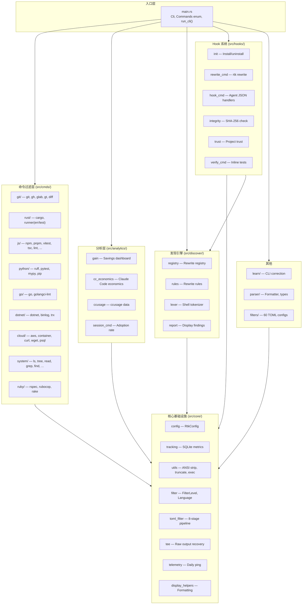

# module-architecture — RTK 模块架构全景

> **研究日期**：2026-06-06
> **研究阶段**：P1.2
> **研究方法**：映射分析

## 概述
绘制 RTK 完整模块依赖图，分析模块职责边界和数据流方向。

## 核心发现

1. **层次化模块结构**：8 个顶层模块，core 作为基础设施被所有模块依赖
2. **命令过滤是核心**：`cmds/` 是最大模块群，按生态系统（git/rust/js/python/go/...）组织
3. **双向依赖设计**：Hook → Rewrite → Discover（Registry），形成完整的命令重写链路
4. **Tracking 贯穿全栈**：从 run_fallback 到各 filter 都调用 tracking，实现全链路指标收集
5. **配置驱动**：config.toml 作为全局参数源，影响 tee/display/tracking/hooks/filters

## 详细分析

### 模块依赖图



### 模块职责矩阵

| 模块 | 文件数 | 主要职责 | 核心输出 |
|------|--------|----------|----------|
| `main.rs` | 1 | CLI 解析 + 命令分发 + fallback | exit code |
| `core/` | 14 | 共享工具、配置、追踪、过滤引擎 | API for all modules |
| `cmds/` (9 生态) | 30+ | 各生态系统的命令过滤 | filtered stdout |
| `hooks/` | 7 | Hook 安装/重写/完整性校验 | settings.json, RTK.md |
| `analytics/` | 4 | 统计面板、经济学分析 | terminal dashboard |
| `discover/` | 4 | 命令重写注册表、历史分析 | savings recommendations |
| `learn/` | 2 | CLI 错误纠正检测 | rules file |
| `parser/` | 2 | TOML/JSON 解析 | structured output |
| `filters/` | 60+ TOML | 声明式过滤规则 | filtered text |

### 数据流图

```
User CLI / LLM Agent Hook
         │
         ▼
    [ main.rs ]
    Clap Parse ──► Commands 枚举 match
         │                │
         │ Err ──► run_fallback()
         │           ├─ TOML filter match → filter → output
         │           └─ No match → passthrough
         │
         ▼
    [ cmds/ filter ]
    execute_command() → filter_*() → print!
         │                    │
         ▼                    ▼
    [ core/tracking ]    [ core/tee ]
    SQLite INSERT         Save raw if failed
         │
         ▼
    [ analytics/ ]
    gain / cc_economics / session
```

### 关键架构决策

1. **无分层隔离**：cmds 直接依赖 core，没有中间层抽象（保持简洁）
2. **TOML filter 作为 fallback 的第二级**：`run_fallback()` 在主路由失败后查找 TOML filter
3. **Hook 与 Discover 共享 Registry**：`rewrite_cmd.rs` 和 `discover/rules.rs` 共用同一个命令重写注册表
4. **内联测试嵌入源码**：所有 filter 在 `mod.rs` 旁使用 `#[cfg(test)]` 内联测试
5. **无 pub/sub 或事件系统**：全同步调用链，无中间件概念

## 结论与洞见

1. **模块边界清晰**：8 个顶层模块各司其职，core 作为共享基础设施
2. **数据流单向**：命令输入 → 过滤 → 追踪 → 输出，无循环依赖
3. **命令过滤是价值核心**：30+ filter 模块支撑 100+ 命令的过滤
4. **TOML 管道是隐藏的扩展引擎**：60+ 内置 filter + 项目级 + 用户级
